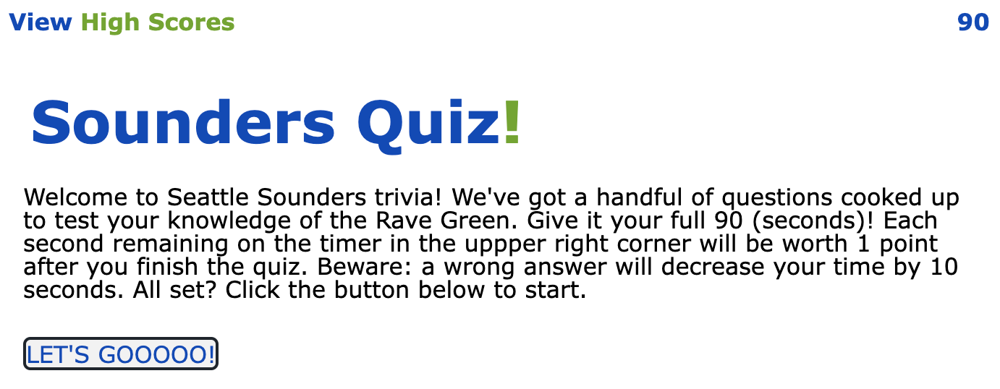
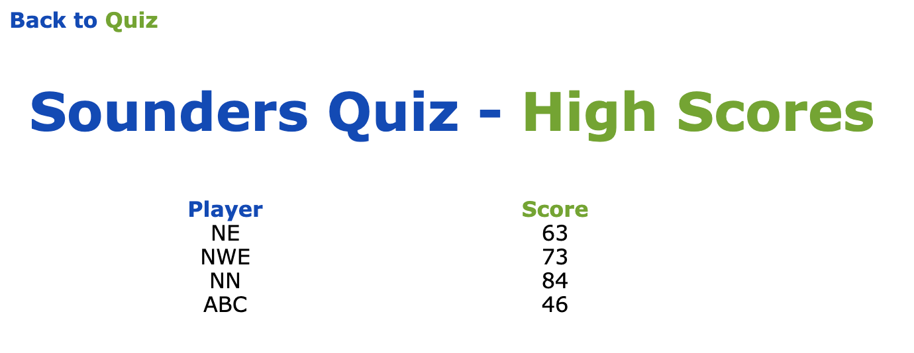

# sounders-quiz
Homework 04 Web APIs: Code Quiz - Create online quiz game

Quiz game created per acceptance criteria listed in [W4-hw_readme.md](W4-hw_readme.md).

## Work Done
* Quiz created and live
* When start button is clicked, timer starts and question is presented
* When a question is answered, the next question is presented
* When a question is answered incorrectly, time is subtracted from clock (10 sec)
* When all questions are answered or when timer runs out, game ends
* When all questions are answered and game is over, player can save initials and score

## Links
URL for published page: https://thenickedwards.github.io/sounders-quiz/

URL for GitHub repo: https://github.com/thenickedwards/sounders-quiz

## Screenshots of Page(s)

